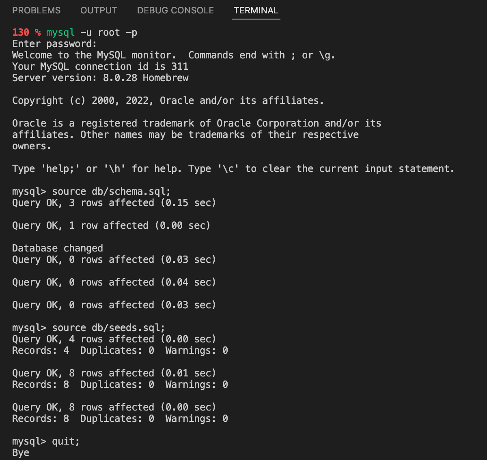
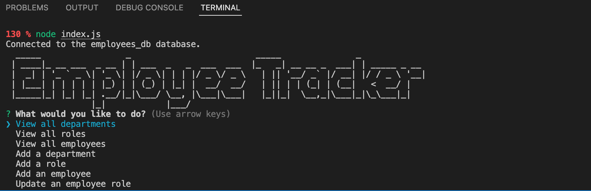
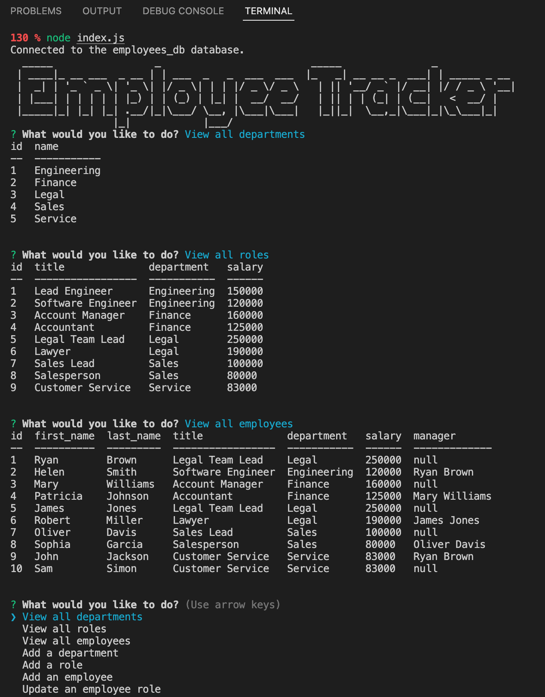

# Employee Tracker - MySQL Project


## Link
Please click [here](https://watch.screencastify.com) to find the walkthrough video that demonstrates the functionality of the Employee Tracker application

## Description

The Employee Tracker is a command-line application that helps to manage a company's employee database, using Node.js, Inquirer, and MySQL. By selecting the actions from the main menu of the application, user can view and manage the departments, roles, and employees for the company. 

Please follow the provided installation instruction below to set up the environment before running the application and user can stop the application at any time by pressing Ctrl+C in terminal.

## Table of Contents 

- [Link](#link)
- [Description](#description)
- [Installation](#installation)
- [Usage](#usage)
- [Technology](#technology)
- [Credits](#credits)
- [Assets](#assets)
- [License](#license)

## Installation

Please follow the installation instruction below to set up the development environment for running this application:
- Clone the Repo for this application
- Install [MySQL](https://dev.mysql.com/doc/mysql-installation-excerpt/5.7/en/) in your local machine if you do not have one yet 
- Open the terminal and find the directory where the Repo has been cloned to
- Enter the following commands in terminal:
    - `npm init -y` - to generate the package.json and package-lock.json
        - If both files already exist, then skip this step
    - `nmp i inquirer` - to install Inquirer 
    - `npm i mysql2` - to install Node MySQL 2
        - In order to run mysql, make sure to install it in your local machine and create your own root password
    - `npm i console.table` - to install console.table
    - `npm i figlet` - to install Figlet
- Make sure your Repo has the .gitignore file which includes `node_modules` and `.DS_Store` (for macOS) before installing any npm dependencies

## Usage

Please follow the usage instruction here:
- Clone this Repo to your computer
- Open the terminal and go to the directory that this Repo has been cloned to, then open this `employee_tracker_mysql_project` folder
    - Make sure to install MySQL before running the application
    - To start MySQL: enter `mysql.server start` in your terminal
- Enter the following comminds in terminal to pre-populate the database: 
    - Make sure that you are in the `employee_tracker_mysql_project` folder
    - `mysql -u root -p`
        - enter your root password if there is one
        - please go to `index.js` file and replace your own password in line 14 for creating connect to the database
    - `source db/schema.sql;`
    - `source db/seeds.sql;`
    - `quit;` - to quit MySQL
    
- Follow the installation instruction above to install npm Inquirer, npm MySQL2 package, npm console.table package, and npm Figlet
    - This app will use npm console.table to print MySQL rows to the console
    - This app will use Inquirer to collect user input
    - This app will use MySQL2 package to connect to your MySQL database and perform queries
- Type the following commands in terminal to start the application: 
    - To start the app: `node index.js`
    - To stop the app: `Control+C` then close your terminal
- Answer the prompts/questions that displayed in your terminal
    - Select any action you would like to do from the main menu:
        - view all departments; 
        - view all roles; 
        - view all employees; 
        - add a department; 
        - add a role; 
        - add an employee; and 
        - update an employee role
- Press `Control+C` anytime in your terminal to stop the app

## Technology
```
JavaScript
Node.js
MySQL
```

## Credits

The Employee Tracker application is functioning with [npm Node MySQL 2](https://www.npmjs.com/package/mysql2), [npm Inquirer.js](https://www.npmjs.com/package/inquirer), [npm console.table](https://www.npmjs.com/package/console.table), and [npm Figlet](https://www.npmjs.com/package/figlet)

## Assets

The following images demonstrate the Employee Tracker's functionality:

To start the application:

 

 The Employee Tracker with tables:

 

## License

Copyright (c) 2022 Elaine D. This project is licensed under the terms of the MIT license.
